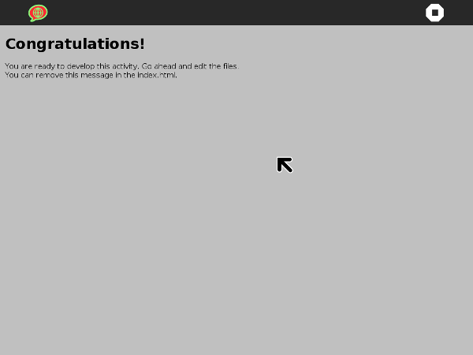

Write your own web activity
===========================

After you have [built](dev-environ.md.html) the development environment, enter
the sugar-build shell

    ./osbuild

Create an activity based on the default template

    volo create my-activity ./sugar-web-template
    cd my-activity

Choose a name for your activity.  Write it in the activity name and
bundle-id in `activity/activity.info`, and also in the title tag of
`index.html`.

Install the activity for development

    python setup.py dev

Now you should have a basic activity running!

### File structure

In your new activity, you will find the following file structure:

    my-activity/
    |-- activity/
    |   |-- activity.info
    |   `-- activity-icon.svg
    |-- index.html
    |-- css/
    |   `-- activity.css
    |-- js/
    |   |-- activity.js
    |   `-- loader.js
    |-- lib/
    |-- package.json
    `-- setup.py

* `activity/` contains information about your activity, including the
  name, ID, and the icon.

* `index.html` is where the elements that compose your activity are
  defined.  The template comes with a toolbar and a canvas where you
  can place your content.

* `js/activity.js` is where the logic of your activity lives.

* `css/activity.css` is where you add the styling of your activity.

Those are the files you'll modify.  The others are:

* `js/loader.js` configures the libraries paths and loads your
  `js/activity.js`

* `lib/` contains the libraries

* `package.json` contains information about the libraries the activity
  depends

* `setup.py` lets you install your activity or make an installable
  bundle with it

Now you are ready to go ahead and develop your activity in the html,
js and css files.

### Revision control your code

For development you can initialize the repository as a git
repository. This will help you to track your changes. First use [git
init](https://www.kernel.org/pub/software/scm/git/docs/git-init.html)
to initialize the repository:

    git init

With [git
status](https://www.kernel.org/pub/software/scm/git/docs/git-status.html)
you can show the available files in the folder they are still
untracked. You do not want to track the lib folder as this is a copy
of the upstream libraries. You can exclude those by creating a
[.gitignore](https://www.kernel.org/pub/software/scm/git/docs/gitignore.html)
file that has:

    # ignore the lib directory as those is only a copy
    lib

Now add all the files in the directory besides the lib folder and
commit those changes, you can use git status again to see the current
state:

    git add .
    git commit -a -m 'Initial import'
    git status

### Debugging

If you want to inspect the code, you can press ctrl+shift+I while your
Activity is running.

It is a very useful tool for many things. For example, you can edit
the activity CSS or HTML, and interactively see how it is affected. Or
you can write JavaScript commands in the console.

Of course it has more advanced tools for JavaScript debugging. Here is
a nice document:
<https://developers.google.com/chrome-developer-tools/docs/javascript-debugging>.

### Keeping Sugar libraries up to date

The activity depends on the
[sugar-web](http://github.com/sugarlabs/sugar-html-activity) library
that provides the Sugar API and the Sugar look & feel.

This means that if there are changes to the library you have to update your
local copy. You can do this with running the following command inside the
activity directory:

    volo add -f

### Ready to release

Before your first release, you should:

* make your activity unique in the Sugar interface by changing your
  activity icon activity/activity-icon.svg .  Or if you don't have
  graphics skills, you can ask in the community if someone can do it.

After that, you can make an XO bundle and upload it to the Sugar
activities market <http://activities.sugarlabs.org/> .

    python setup.py dist_xo

For further releases, you should update the activity_version in
`activity/activity.info`.
