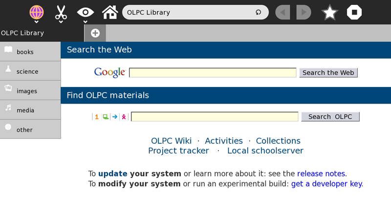
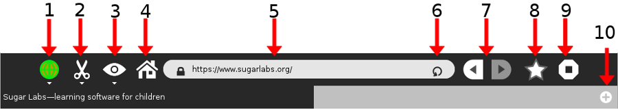
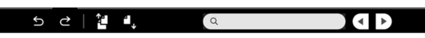
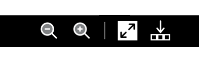
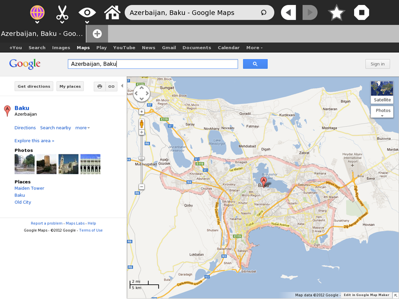

# Activities - Browse
## Table Of Contents
1. [About](#ABOUT)
2. [Using Browse](#USING-BROWSE)
3. [Learning With Browse](#LEARNING-BROWSE)
4. [Extending Browse](#EXTENDING-BROWSE)
5. [Reporting Problems](#REPORTING-PROBLEMS)

## Browse
### <a name="ABOUT"> About
The Browse activity is your means to explore a wider source of information and content that can be found in what’s called the World Wide Web (Internet or Web for short). Although there are some built-in information included on this activity (OLPC Library), to make the most of this activity you need an internet connection. Please see the chapter on “Neighborhood View and Connecting to the Internet”.

The first thing that you will see when you first click on the Browse icon from the Home View is what’s called the Home page.

### <a name="USING-BROWSE"> Using Browse

1. Activity Tool
2. Text/Edit Tool
3. View Tool
4. Home
5. Address Bar (URL)
6. Refresh/Reload
7. Navigation Arrows (Back & Forward)
8. Bookmark
9. Stop
10. Window tab

(Note: To see the name of the tool/button, you can put your mouse arrow on top of its picture)

__Activity Tool__

__Browse Journal Entry Name__ - This will serve as the name of the Journal entry. Change this to something distinctive especially when you have multiple window tabs opened that’s related to one particular topic.

__Browse Description Bar__ - This will serve as the Browse activity description in the Journal.

__Privacy Tool__ - Use this to change the privacy setting of the current Browse activity. The default is set to Private.

__Text Finder and Edit Tool__

__Undo__ - The Browse activity remembers the last change that you’ve made on the page. Use this button to step back to the last change that you made.

__Redo__ - Use this button to go back to the current changes that you made after doing an “Undo”.

__Copy__ - This is used to copy a text or passage from the current page you are viewing. To do this, you need to first highlight (left-click while dragging your mouse arrow) the text. You know you’ve highlighted a text when its background color turned grey. Then, press this tool to copy it to the clipboard. A small image on the left hand side of the frame will appear. This “holds” the text you just copied. You can now “paste” this text or just simply click and drag it to other activities. The copied text will disappear once the XO is restarted or shutdown.

__Paste__ - This tool is for pasting texts from other activities into the current page that you are viewing. You can only paste texts on areas of the page where pasting is allowed. It will remember this text until the XO is restarted or shutdown.

__Text Search Bar__ -This tool is great to use when you need to quickly find a text on a current page you’re viewing. Press the enter key to go down the page. The text that you are looking for would be highlighted in green. Press the little “x” symbol on the right of the bar to erase the text.

__Text Search Navigation Arrows__ - While you can press the Enter key to search down the page, these arrows are useful to search the page. Use the left arrow to go back up the page and the right arrow to go down the page.

__View Tool__

__Zoom Out__ - When you want to see more of the page, use this tool to make it smaller.

__Zoom In__ - When you want to see things better, use this tool to make the page bigger.

__Full Screen__ - You can press this to see the entire page without the toolbar.

__Tray Toggle button__ - This tool only works when you have things on the tray (the space on the bottom of the Browse page) like pages that you have bookmarked (Please see bookmark description). Use this tool to make the tray visible or invisible. Browse remembers your bookmarked pages even when the tray is not visible. Just simply make it visible again to see those bookmarks.

__Home Icon__

Clicking this takes you back to the Home Page. Useful when you’re lost and need a starting point.

__Address Bar__

Each page on the internet has its own address. The address bar shows you the current web address of the page you are viewing. If you know the web address of a page, you can type it on this bar and press the enter key to navigate to that page.

__Bookmark__

Sometimes it is useful to remember the pages that you visited. Clicking this icon will save the web address of the current page you are viewing. A small thumbnail image of this page will appear on the bottom(tray). Bookmarks are saved only on the current Browse activity. They will not show up when you open a new Browse activity.

__Stop Activity Tool__

Closes the current Browse activity.

__OLPC Library__

The Browse activity has built in books, information and pages that you can access even without a connection to the internet. Click on any of the texts to see what you can find. Have fun exploring!

__Copying Images From The Web__

Note: Every time you create something whether it’s a poem, a book or a nice picture, you own those works. The internet is filled with information and works that result from hard work and creativity of other people. Some owners of those work like to share them freely, but others don’t or require that you give them the credit. Sometimes this information can be found on the page you are viewing. When in doubt make sure to make a note in your documentation on where you found the information. A great page for further reading [here](http://www.copyrightkids.org/)
To copy an image, point your mouse arrow on the picture and right-click on it (press the button on the bottom of your track pad that has a circle on it). A box similar to the picture shown above will appear with information on the source or web address of the picture along with the file name of the picture. There are two ways to copy an image:

__Keep Image__ - this will put a copy of the image to the Journal.

__Copy Image__ - this will place a copy of the image to the clipboard, which you can then drag and drop to another activity. This copy is temporary and will disappear from the clipboard when you shutdown the XO. So if you need to save the image, it is best to do a “Keep Image” instead.

### <a name="LEARNING-BROWSE"> Learning With Browse
Browse gives access to the internet which is a powerful information and communication tool and allows students to participate in the global community and experience. There are so many things on the web that you can use and incorporate in your classroom, but one of the many great ways to start is to help students make sense of where they are in relation to this global context. How far are they from the earthquake’s epicenter that rocked Japan? Where is their country’s capital? How big is their country compared to others? Where are the historical places in their country and the world that shaped human history and culture? One of the many great tools on the web that can be readily and freely accessed is Google maps (type this on the address bar): http://maps.google.com/

If you live in an area that is adequately mapped by Google Maps, you can ask students to use the “Get directions” tool on the page to see how they can go from one place to another. The directions tool can also teach students a sense of distance by showing how far two places are from each other. Example, how far do they travel every day for school (Given that sense of distance, how far and how long will it take to get to the nearest city or town)?

### <a name="EXTENDING-BROWSE"> Extending Browse
There’s a built in Google search bar on the home page of Browse that you can direct students to aid in their research. Help them narrow or expand their search texts to come up with better search results.

To allow students to be active participants in the global community, communication tools can be freely and readily accessed via Browse: from creating free e-mail accounts to tools that allow people to create their own internet sites and pages.

But like with any type of exploration, you have to start with caution. Not all information on the internet is good. Start with educating kids to safely use and explore the internet. You can check out sites like [this](http://www.wiredkids.org/kids/index.html) for more information.

### <a name="REPORTING-PROBLEMS"> Reporting Problems
In [http://bugs.sugarlabs.org](http://bugs.sugarlabs.org), component Browse.

Browse was developed and maintained by: Lucian, Sascha Silbe, erikos, manuq

Browse can be downloaded from the [Sugar Labs Activities repository](http://activities.sugarlabs.org/).
