# Network

## Table Of Contents
1. [Give Me The Internet](#GIVE-ME-INTERNET)
   1.[Before Connecting](#BEFORE-CONNECTING)
   2.[Connecting](#CONNECTING)
   3.[Checking Access Points (AP)](#CHECKING-AP)
   4.[Mesh Or AP](#MESH-OR-AP)
2. [Getting Connected](#GETTING-CONNECTED)
   1. [Connecting Through AP](#CONNECTING-AP)
   2. [Note To Parents And Teachers](#CONNECTING-PARENTS)
3. [Troubleshooting Connectivity](#TROUBLESHOOTING)
   1. [Common Connectivity Problems And Solution](#COMMON-PROBLEMS)

## <a link="GIVE-ME-INTERNET"></a> Give Me The Internet
The designers of the XO laptop designed it for primarily wireless access, so it can work well in developing nations, where it is faster and less expensive to introduce wireless connections than wired ones.

XOs are designed to connect to other XOs using a mesh network. A mesh network allows nearby XO laptops to talk to one another directly (wirelessly) without the need for a traditional Internet Service Provider (ISP).

The XO also supports wireless connections for direct Internet connection. Collaboration with others on Activities does not require an Internet connection.

There are different ways to connect to the Internet-
  * using a wireless access point such as a WiFi hotspot at a library or coffee shop, or a location that has a wireless router such as your house
  * using a “School Server” provided by your school system
  * using a USB-to-Ethernet cable that plugs into a cable modem, DSL modem, or local network such as those offered at a home or workplace
  
### <a link="BEFORE-CONNECTING"></a> Before Connecting
If you are going to connect at school or at home, check with your ISP to find out if the network is protected with a password. Your router also has a password which can be found in its documentation. Become familiar with your wireless router settings so that you can troubleshoot the connection if needed. The Troubleshooting chapter offers some assistance.

Check your current connection status as shown in the lower right area on the Frame. If you have connected successfully in the past, the XO “remembers” the connection and will connect again in the future.

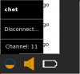

Go to a location with your XO where you know there is a Wireless Access Point (WAP) nearby. Find out the network name (or SSID) and its password, if it is secured with a password. The XO refers to this as the Wireless Key.

### <a link="CONNECTING"></a> Connecting
Go to the Neighborhood View. In the Search field, enter the name of the network to which you want to connect.

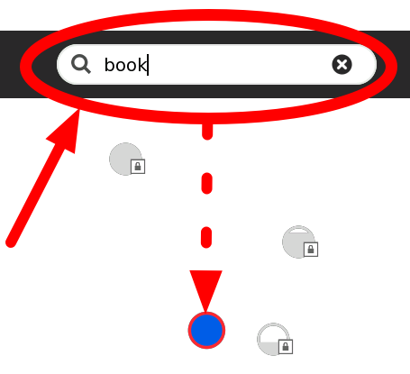

Or roll the pointer over one of the network access circles until you recognize the name of the wireless network.

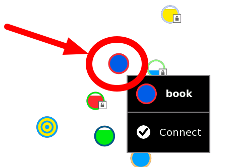

### <a link="CHECKING-AP"></a> Checking Access Points (AP)
Connect by clicking the center of the circle. Wireless access points are represented by circles. The fill level indicates signal strength. Access points that require keys have a “locked” icon. Access points that you have successfully connected to become “Favorites” as indicated by a star icon.


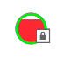


Access points that represent the Mesh network are indicated with a target icon, with one for channel 1, one for channel 6, and one for channel 11. Hover your pointer over the access point to see if you’re already connected or if you need to click to connect.
  * The name of the access point is displayed when you hover over it.
  * The center of the circle blinks while the laptop is trying to connect.
  * Enter the wireless key if prompted. You might need to ask your teacher or parent for the wireless key.

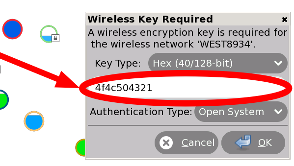

Entering wireless encryption (WEP) password-
  * While the XO is connecting to the network, the Access Point blinks.
  * Once you are connected, the menu on the circle in the Neighborhood View changes, and you can see a circle in the lower right area of the Frame.
  * If the attempt to connect fails, the circle stops blinking, but the access point icon does not appear in the Frame. Click the circle in the Neighborhood View to try again—it sometimes takes 2–3 tries to connect.
  * To disconnect from the network, hover the pointer over the access point and click Disconnect on the menu.
  * Once your XO is connected, you can return back to the Home View and launch the Browse Activity.
  * If you have not yet added the Browse Activity to your favorites, click the List View (left) and scroll to Browse. Add the Activity to your favorites list by clicking the star next to it (1). Launch Browse for the first time by clicking the globe icon (2). Next time, you can use the freeform view to launch it (as is done in the next step).
  * If you have added the Browse Activity to your favorites list, you can click the globe icon to open the Browse Activity and test your access to the Internet.
  * Click the globe icon to launch the Browse Activity.

If you cannot see an Access Point with a name that you recognize, the wireless antenna might be too far away, or the Access Point might not be working properly. For more information, or if you have difficulties getting a network connection, refer to the Troubleshooting chapter.

More information about your XO’s connection-
  * Your Wireless Access Point has a network name, also called an SSID, that displays in the Neighborhood View. The XO cannot recognize SSIDs that are hidden, which is configured on the access point. Refer to the Troubleshooting chapter for more information about hidden SSIDs.
  * If you are connected to the Internet, your XO laptop cannot be on the mesh network, and if your XO is on a mesh network, it cannot simultaneously connect wirelessly to the Internet.
  
### <a link="MESH-OR-AP"></a> Mesh Or AP
  * If the XO cannot find an available Internet network point after five minutes of searching, it defaults to Mesh Network 1, which enables your XO laptop to connect to other nearby XO laptops.
  * Please be patient; it can take your XO up to a minute to find newly visible networks.
  * Sometimes you’ll be asked to enter the “Wireless Key” again. Enter it again and repeat until your connection is complete.
  * For more information about connecting, please see the Support FAQ online.
  
## <a link="GETTING-CONNECTED"></a> Getting Connected
A primary goal of the Sugar learning platform is enabling students to learn and work together.

In a wireless environment, an access point (AP) is a device that allows your computer to connect to an existing set of communicating devices. The access point usually has a direct connection to the internet, and can relay data between the wireless devices and the devices it can access.

There are multiple ways to connect to others-
  * wireless access point (WiFi hotspot);
  * wired network—may require an external adapter;
  * OLPC “School Server” mesh network;
  * OLPC “simple” mesh network, which lets you collaborate directly with other Sugar users.

### <a link="CONNECTING-AP"></a> Connecting Through AP
You can connect from the Neighborhood View. You can see information about the connection on the Frame.

__Step 1__ : Go to the Neighborhood View.Go to the Neighborhood View to connect to an access point.

Tip: To access the Neighborhood View, click on the Neighborhood Icon on the Frame or by pressing the F1 key.

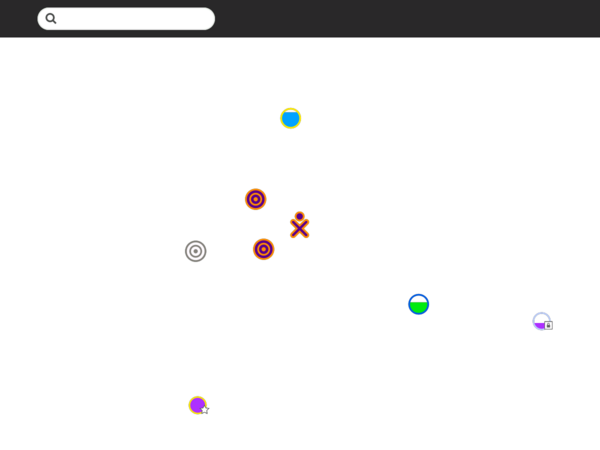

__Step 2__ : Choose an access point. Networks (access points) are represented by circles on the Neighborhood View. Hover over a circle to see more information about an access point. An access point is identified by the name (ESSID) it broadcasts. An OLPC laptop mesh-point—represented by a series of concentric circles—is identified by its channel number (1, 6, or 11). You can also search for an access point by name in the search bar at the top of the page.

Note: If an access point is not broadcasting its name, the Neighborhood View may show that AP with some other name.

Signal strength is indicated by the fill level of the circle. The color of the circle is based upon the name of the access point. A lock icon identifies networks that are secured and require a key (passcode) to use. A star icon identifies access points that have been previously used (favorites).

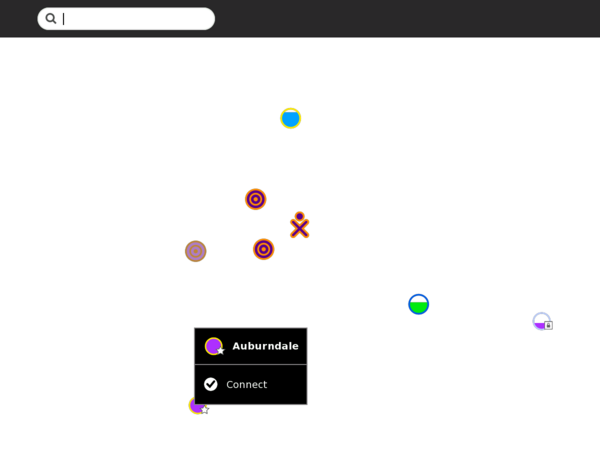

__Step 3__ : Activate a connection. To activate a network connection, click once inside the circle that corresponds to your chosen access point (or click on the Connect option in the hover menu).

While the connection is being established, the inside of the circle will blink. Once the connection is established, an icon for that connection will be shown on the bottom edge of Frame. If for some reason the connection failed, the circle will stop blinking. Sometimes it is necessary to try several times before the connection is established.

If the access point is secured and requires a key, a dialog prompts you for the required information. Different access points may require different types of keys. Before entering the key, be sure to select the correct type from the pull-down menu that is presented.

__Step 4__ : Checking the connection. The connection status is detailed in a hover menu.

You can check the status of your connection from the Frame (from any view). By hovering over the circle icon, you will find details about your connection status in a hover menu. OLPC deployments

OLPC has designed a mesh network that allows XO laptops to communicate without the presence of the Internet and a School Server as a means to make their school network connectivity more efficient. The School Server also provides web and chat services.

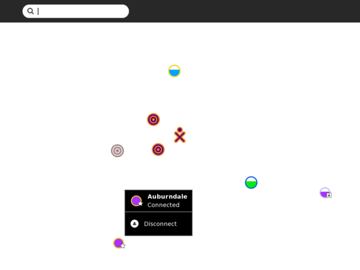

### <a link="CONNECTING-PARENTS"></a> Note To Parents And Teachers
Collaboration between learners is one of the most important features of Sugar. To enable collaboration in a classroom or home setting, it is necessary to establish the same type of connection for each computer. Computers can be connected through a School Server, a simple mesh if they are OLPC XOs, or an access point.

When using an access point for the connection, the computers must all use the same Jabber server in order to collaborate. Please refer to the Sugar Control Panel discussion in the Personalizing Sugar chapter for details regarding the configuration of Jabber.

## <a link="TROUBLESHOOTING"></a> Troubleshooting Connectivity
You can look [here](http://wiki.laptop.org/go/Support_FAQ) for many technical troubleshooting tips, but you should read through all the information on this page to troubleshoot the wireless connectivity yourself. Understanding wireless router configuration

Connect your router to any computer, and then use a web browser to view the router’s configuration page and change the router’s settings.

Here are some common router manufacturer’s administrative addresses, usernames, and passwords used for configuring router information. To find a more complete list, you may try visiting another computer that has an internet connection (for example, the local library) and searching the Internet for router default logins.

|Manufacturer|Address|Username|Password|
|------------|-------|--------|--------|
|3 Com|http://192.168.1.1|admin|admin|
|D-Link|http://192.168.0.1|admin| | 
|Linksys|http://192.168.1.1|admin|admin|
|Broadband|http://192.168.2.1|admin|admin|
|Netgear|http://192.168.0.1|admin|password|
|Gateway2Wire|http://192.168.1.254| | | 

If you are unable to connect a computer to your router to do this, call your Internet Service Provider and ask them for assistance. They should be able to access your router remotely, get the needed information for you, and even make any needed changes.

Your wireless router settings may contain Wired Equivalent Privacy (WEP) or Wi-Fi Protected Access (WPA) for security protection. Find out which type of security it uses and the passphrase either by asking your ISP or by using the router’s configuration pages.

Based on the type of security system being used (WPA or WEP), the Wireless Key type varies. For WPA, you use a Passphrase key (for example, “password”, “tHisisAp4ssword”). For WEP, use either a Hex key (for example, “4f4c504321”, usually all keys that consist of only of 0-9 and a-f) or its corresponding ASCII key (“OLPC!”). 40-bit Hex keys are 10 letters/numbers long, corresponding to 5 letter/number ASCII keys.

### <a link="COMMON-PROBLEMS"></a> Common Connectivity Problems And Solution
Inability to connect with an Access Point from the Neighborhood View is the most commonly reported symptom. The symptom is usually a flashing circle icon where the access point circle icon never appears in the Frame or the circle’s menu never contains “Connected.” This flashing animation indicates the XO is trying to connect, but the lack of connection indicators tells you that it fails to connect. If this happens, try the troubleshooting suggestions just below. Is the wifi hotspot dot visible in the Neighborhood View?

Go to the Neighborhood View and type the name of your SSID in the Seach box to highlight your access point. Each circle network icon represents a Service Set Identifier (SSID). On one of the icons in the Neighborhood View, you should see your Wi-Fi hotspot’s network name.

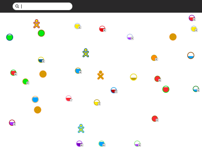
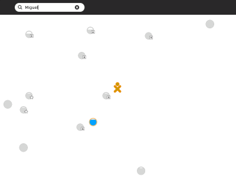

If you cannot see the network name there may be a few reasons for this, so continue troubleshooting.

__Is the name of the network a hidden SSID?__

If your SSID/Network Name is set to be Hidden in the router configuration, it is not possible for the XO to connect to your wireless network through the Sugar User Interface.

You may connect manually by typing commands in the Terminal Activity. To do so, launch the Terminal Activity and type these commands-

```
su -l
/sbin/iwconfig eth0 mode managed essid myhiddennetwork
/sbin/dhclient eth0
```

As an explanation, the su command creates a root process. The iwconfig command connects to your hidden network (of course, substitute the name of your access point for the string myhiddennetwork in the above example). Finally, dhclient asks for an IP address from the access point.

__Is your Wi-Fi router filtering connections based on a MAC Address?__

You can prevent other computers from using your wireless router by configuring it to filter by MAC Address. A MAC Address is a unique address embedded in your computer’s network adapter. While MAC address filtering is not a secure method of protecting a network, some routers use it, and it could prevent your XO from using that access point.

To fix a filtering problem, you can find the MAC Address and add it to the list of allowed computers that can connect with the wireless router.

To do so, launch the Terminal Activity and type these commands-

```
/sbin/ifconfig -a eth0
```

The MAC address is in the first line next to the HWAddr tag: and is in the form of “00:17:C4:XX:XX:XX”. In the WiFi router configuration for filtering, add the MAC Address you found with the ifconfig command.

__Is your WiFi router configured to support 802.11b or 802.11g or both?__

Read the documentation for your wireless router to determine how to configure it for 802.11g support, or to determine if it is using the 802.11g protocol. In this example, the Mode drop-down list is where you would look for protocol settings. It may not work to have both g and b modes as shown, so try different configurations to see if another configuration works.

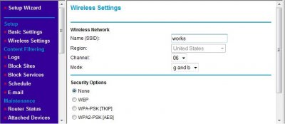

__Are the access point settings not in channels 1, 6, or 11?__

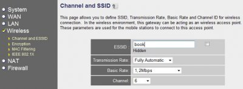

Is your access point working on another channel that is not in 1, 6, or 11? For some older builds, the XO expects to find access points in one of these three channels, the three non-interfering channels available to 802.11g wireless protocol.

Try changing your access point to one of the three channels and check if you can associate your XO to it. Refer to your access point’s documentation for information on changing the frequency channel that your access point broadcasts on. This image shows an example of the settings for a wireless router. The Channel field is where you change the frequency setting.

__Why can’t the XO Browse when connected?__

Symptom: Your XO shows that your Internet connection is working, but you cannot browse or search any pages.

Most likely, the XO has failed to receive DNS information from your internet access point. If this is the case, you would be able to access the Internet for sites named directly with IP addresses but not their common names. In other words, http://209.85.133.18 would work but http://www.google.com would not.

Verify what the XO has received (from the Internet access point) for DNS information by using the Browse Activity and looking at this URL: file://localhost/etc/resolv.conf

This page should show the IP address of the DNS server assigned by the Internet access point. If there isn’t an IP address on this page, or if the IP address assigned is wrong, this would account for the behavior you’re seeing.

If there is no IP address, or the address is wrong, you’ll need to determine why the Internet access point is failing to supply one, but this is likely to be misconfiguration of the access point.

__Connecting to the Internet without wireless access__

If you cannot successfully or consistently connect to the Internet using Wi-Fi, you can use a USB-to-Ethernet connector to hook up to a wired connection rather than wireless. Examples of products that have worked for other users include the Linksys USB100M and the Zoltan Tech USB2.0 Fast Ethernet adapter, which cost about USD $10-$25.

If you want to connect to your XO wirelessly with a dial-up connection, you can do it with an older version of Apple’s Airport Extreme (A1034). Apple no longer sells them, but they are available on the Internet for between $18 and $36. Be sure the one you get has a port for the phone line, and preferably, with a phone cord included. Directions for connecting with it are on the Wiki [here](http://wiki.laptop.org/go/Wifi_Connectivity#Apple_Airport).

Your XO makes a wonderful traveling companion. You can connect to a wide variety of public WiFi sites often found in community centers and libraries, even in restaurants and hotels. All you will need to do is to obtain a correct password and log on according to the instructions above. Many places will not require a password to connect and the process will be even easier. Remember, however, that passwords provide an extra layer of internet security. Without them, you run a slightly higher risk of experiencing some type of Internet fraud.
