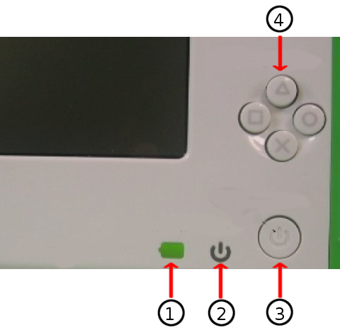

# Support
## Table Of Contents
1. [Upgrading Software](#UPGRADING-SOFTWARE)
2. [Getting Support](#GETTING-SUPPORT)

##  Upgrading Software
Your XO comes pre-loaded with the software OS (operating system) designed for the XO. It is a good idea to keep your software up to date because our latest builds fix bugs in earlier releases and they are awesome!

The XO-1’s came with Sugar software. Did you know that with the latest software your XO can have both Sugar and GNOME? GNOME provides an option to teach older children in a learning environment that will be familiar and transferable to using Windows or Mac OS. This Chapter will tell you how to upgrade your software.

The Software Releases can be found [here](http://wiki.laptop.org/go/Releases).

The [main page of the OLPC Wiki](http://wiki.laptop.org/) also contains links to the latest releases. 
There several methods of upgrading. Which one is right for you? Most people will want to use the “clean install” method. An overview of the upgrade options can be found [here](http://wiki.laptop.org/go/Updating_the_XO).

Clear instructions on how to to change, upgrade, downgrade, or replace your XO’s OS can be found in the Release notes. Choose the release (build) that you want to install [here](http://wiki.laptop.org/go/Releases). Next, click on the Release notes for the release you will install.

Decide whether you want to do a clean install (Installation) which will completely reformat your XO with files from a USB drive, or an online or offline update which will update the current software without erasing the existing Journal. Follow the instruction for the update method chosen.

A clean install uses a USB stick and the “four button procedure” to begin the update. Warning Reminder: This method re-formats your XO and EVERYTHING on your XO will be deleted if you use this method. You will follow the instructions in the Release Notes for the build chosen, and you will need A USB storage device that has at least 1 GB of space free and a computer with Internet access that will allow you to download the required 300-400MB within about an hour.

1. Battery indicator
2. Power indicator
3. Power button
4. Game buttons

Follow these steps to upgrade your XO-
1. Connect your XO to its charger.
2. Turn off your XO.
3. Connect your prepared USB storage device to your XO.
4. Next, hold down all four gamepad keys above the power button, and then push the power button to turn the XO on. You will see a message that tells you to “Release the game key to continue”. Do not continue until you see this message.
5. Release the gamepad keys. The reflash process runs automatically; first you will see the XO arrange and color in a grid of boxes, then the XO will display “Rebooting in 10 seconds...”
6. The XO will then restart with a clean image.
7. Enter your name for your XO and then click Next.
8. Click the XO icon to change the colors and then click Done.
9. Optionally, connect your XO to the Internet, then use the Control Panel to download the latest Activities.

##  Getting Support
One Laptop per Child is an education project, not a laptop project. With connected laptops, learners are liberated to actively engage with others with similar interests in cultures of learning by doing without being limited by time or space. If you are having hardware or software problems with your XO, remember that its design is to encourage you to learn new things by trying to solve problems on your own!

That said, an entire community built this XO and everything on it, and we want to help you with it. Our OLPC global community of volunteers provide software and hardware troubleshooting and support. This section will help tell you where to find Support when you are really stuck! OLPC has proven that volunteer-driven support works, often with far more heartfelt caring than any corporate help desk!

If you have questions about the XO, ask a teacher for help, a friend, or search on the Internet. If you have a question about your XO, there is a very good chance it is already answered within our expanding [Support FAQ/RTFM knowledge base](http://wiki.laptop.org/go/Support_FAQ)
Next try looking [here](http://support.laptop.org) for extensive helpful guidance for exploring and fixing your XO, allowing you to solve challenging issues right alongside others. Specifically, check out:
  * [Getting Started](http://laptop.org/start)
  * [Email Lists](http://lists.laptop.org)
  * [Live Chat](http://forum.laptop.org/chat)
  * [OLPC Community](http://wiki.laptop.org)

If you are still unable to find an answer online, please email help@laptop.org.

Did you know that our volunteers staff a live Help Chat site 24/7, on the Internet? Click [here](http://forum.laptop.org/chat). Login with the color-name shown; that’s guest ID. Type your question in the chat line at the bottom. You may have to wait for a response as our volunteers come in and out. If you are patient, we can probably help you! To learn more about what Internet Relay Chat (the system that makes this possible) is, click [here](http://wiki.laptop.org/go/IRC).

We would also like to make special mention of our Support Gang, where an enthusiastic group of volunteers assist XO users all over the world. If you are impressed with the passion and hard work of our volunteers, please consider giving back, by joining our dedicated community. Take a look at the [link below](http://wiki.laptop.org/go/Support_Gang). We would welcome your participation! Be sure to review the Frequently Asked Questions (FAQ) [link above](http://wiki.laptop.org/go/Support_FAQ). Many of us join and “learn by doing.”

Thanks very much! OLPC Support Gang
