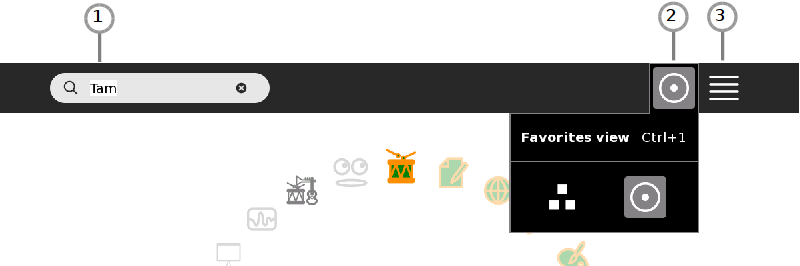
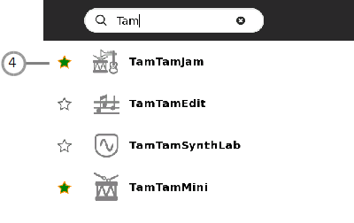
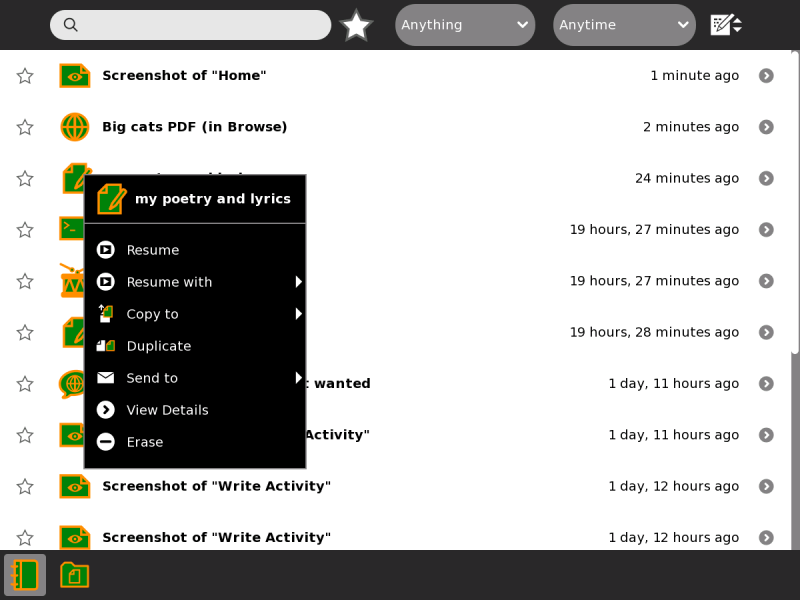
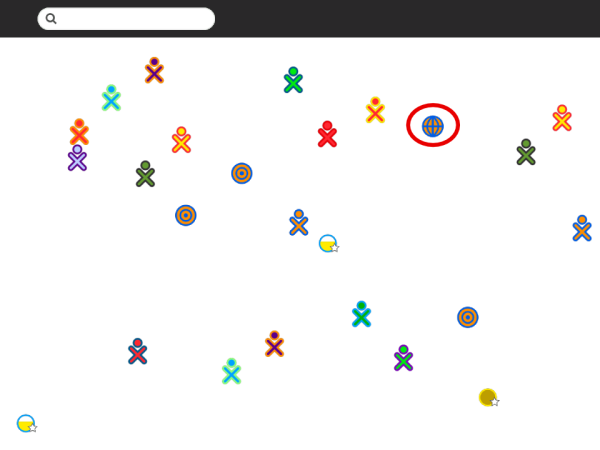
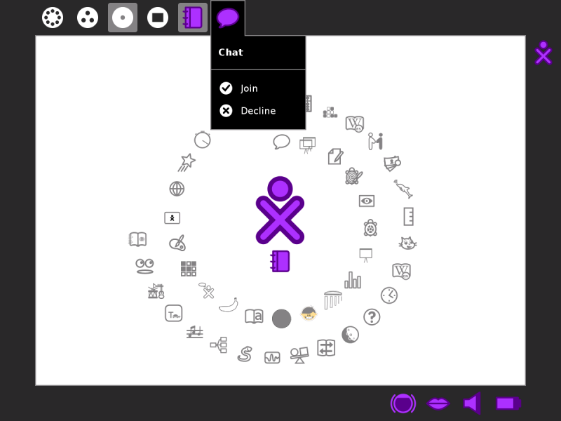
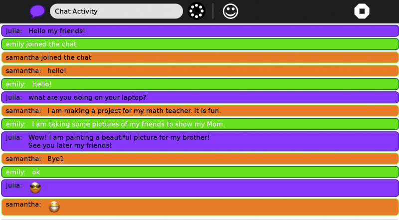

# Using Activities
## Table Of Contents
1. [What is an Activity?](#ACTIVITY)
2. [Launching Activties](#LAUNCHING-ACTIVITY)
   1. [Launching Activities From Home View](#LAUNCHING-HOMEVIEW)
   2. [Resuming From Journal](#RESUMING-JOURNAL)
   3. [Joining Activities](#JOINING-ACTIVITY)
3. [Switching Activities](#SWITCH-ACTIVITY)
4. [Collaborating](#COLLABORATING)
   1. [Chatting](#CHATTING)
   2. [Collaboration Using Distance Activity](#COLLABORATING-DISTANCE)
5. [Exiting Activities](#EXITING-ACTIVITY)

##  What is an Activity?
Activities are the things you use to make projects in Sugar on your XO. Activities are found on your “Home” view in the circle around your “person” icon.

These activities have been selected from all those installed on your laptop. They are called “Favorites”. You can change this list at any time by clicking on the “List” view (1) in the upper right corner of your screen.

To start an activity, you can click its icon. This will open the last project you were working on. You can also see all your recent projects by hovering your pointer over the icon and look for the name of which you saved your project. In order to open a new session, hover your pointer on the icon and click “start new”.

There is one special activity called the “Journal” which appears under your “person” icon, if you have no other Activities open, and on the Frame, or you can press the magnifying glass key in the top row of the keyboard to immediately open the Journal and search. The Journal keeps track of everything you do on the XO. It also stores the files you create with your Activity. Some Activities need no instruction or explanation, such as Maze and Speak. There are other Activities that require some learning and exploration, such as Turtle Art, Etoys, and Scratch.

There are Activities which are games, such as Memorize and Implode. Some perform basic functions such as writing documents (Write), taking pictures or videos (Record), or browsing the Internet (Browse). Other Activities allow you to create complex images, games, animations and programs : Scratch, Etoys, TurtleArt. You can also make music with Tam Tam and use it in your animation, or story or Memorize game.

A set of Activities is pre-installed with the Sugar environment. More Activities can be found and added to your XO from the [Sugar Activity Library](http://activities.sugarlabs.org). You can also add Activities from a USB drive (thumb drive).

##  Launching Activities
You can launch an Activity in four different ways:
  * Click the Activity icon in the Home View.
  * Resume your previous work with an Activity from the Journal.
  * Join a shared Activity from the Neighborhood View.
  * Accept an invitation by clicking the invitation icon on the Frame.
  * When you launch an Activity, its icon flashes in the middle of the screen while it loads.
  

Once the Activity is running, you will be placed into its Activity View.

###  Launching Activities From Home View 
To get to the Home View, click the Home icon on the Frame frame or press the F3 key. On the XO keyboard this key has a single dot, and is one of the view keys. Then click on the icon of the activity you want to start. If you aren’t sure you have the right activity, hover your cursor over the icon for a few seconds and a label will appear with the activity name.

If you’ve run the Activity before, clicking the icon will resume with your last Journal entry. If you click the right menu button or hover the cursor over the icon for several seconds, a menu appears with other Journal entries you made with the activity, and an option to “Start new”.

If you don’t see the Activity’s icon, click the menu icons (2) (3) to change how the Home view displays activities. Or type part of the Activity’s name in the search box (1).

In list view mode (3) you can click the star (4) next to an Activity’s name to add/remove it as a favorite. Favorite Activities appear in the favorites view.

###  Resuming From Journal
Click the activity’s icon or click Resume on its hover menu.

You can also launch some journal entries in a different activity using the hover menu. For example, you can resume an image you made in the Paint activity in Etoys or Browse.

You can click the first drop-down menu in the Journal to only show certain kinds of entries or those made with a particular activity.

###  Joining Activities 

As for joining an Activity by accepting an invitation, click Join in the hover menu on the Frame. Note: Try not to open more than three Activities at one time or your computer may go slow.

##  Switching Activities
You can switch between Activities in two ways:

In the Frame, click the icon of the Activity you want to switch to.
Hold down alt + tab at the same time to cycle through your open Activities until you reach the one you want.

__Note__ : You can use the Clipboard and the Journal to move data between Activities.

## <a name="COLLABORATING"> Collaborating
One of the most important features of Sugar is the ability for you to collaborate, or network, and share a project that you are working on with others. This can take the form of multiple cursors in a document, multiple musical instruments, two players in a game, multiple uses in chat, and so on. Many Activities support collaboration, see below, Where to get Collaborating.

This image is from the Activity toolbar of Write, which is an Activity which supports collaboration.

The highlighted button is the collaboration, or sharing, “switch”. The options are

 Home icon, which, when you hover the cursor over, reveals “Private”. This is the non-sharing option, with no networking.

 Neighborhood icon, which, when you hover the cursor over, reveals “My Neighborhood”. This is the sharing option, that is, networked.

In some activities, the collaboration button is grayed (disable), that means the activity can’t collaborate.

###  Chatting
An example of collaboration, or networking, is chatting. Chatting is available in the Sugar Activity Chat.

### <a name="COLLABORATION-DISTANCE"> Collaboration Using Distance Activity
If you want to share with one of your friends, inside the Activity that you want share, click on the “Home” icon that says “Private” then click on the “Neighborhood” icon, like below.

This will make it available to all other persons connected to your same Ad-hoc network. An icon of the Activity you are sharing will appear in the Neighborhood view inviting others to join. To join, all they will need to do is hover over the icon of the Activity you are sharing and click join. (This is also how you join the work of others when they share with you).

Collaborating is a built-in function in the following Activities:
  * Browse
  * Calculate
  * Chat
  * Distance
  * Etoys
  * Image Viewer (not marked Favorite)
  * Implode
  * Maze
  * Memorize
  * Pippy
  * Read
  * Record
  * Speak
  * TamTamMini
  * TamTamJam
  * Turtle Art
  * Write
  
Note: Not all Activities are able to collaborate. There are many others available in the Sugar Labs Activities repository

##  Exiting Activities
To stop an Activity, use the touchpad or a mouse to move the cursor to the stop button on the right corner and click. Try to have no more than three Activities open at once.

To stop an Activity using the keyboard, press and hold the Ctrl key, and then press the Q key. There are some exceptions below.

__Scratch__

There are some “Activities”, such as Scratch, that are stopped from the “File” menu by selecting “Quit” or “Exit”. These activities may require a separate step to save your work by clicking on the “Save” or “Save As” command or may also be done by clicking the folder icon with a downpointing arrow.

In Scratch, for example, you must go to “File” then “Save As” then give your project a name next to “New Filename” then click “OK”.

__Etoys__

The Etoys Activity is stopped by clicking a button that has an ✕ within a white disc, rather than the stop sign.

__Terminal__

The Terminal Activity must be quit using Ctrl/D, Ctrl/Shift/Q, or the stop button. This is because Ctrl/Q has a special meaning in a Terminal.
