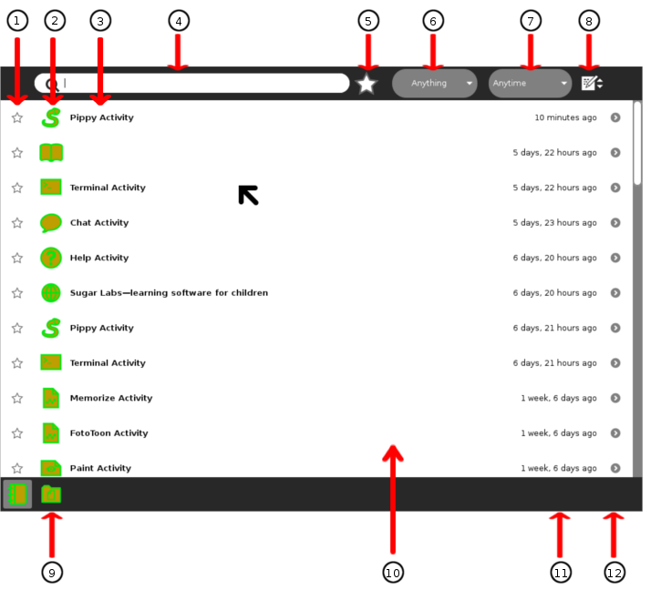

# Using Sugar

## Table Of Contents
1. [The Sugar User Interface](#SUGAR-USER-INTERFACE)
   1. [For Parents And Teachers](#SUGAR-FOR-PARENTS)
2. [Home View](#HOME-VIEW)
   1. [Ring View](#RING-VIEW)
   2. [List View](#LIST-VIEW)
   3. [Freeform View](#FREEFORM-VIEW)
   4. [Activity Menu](#ACTIVITY-MENU)
   5. [XO Menu](#XO-MENU)
3. [Neighbourhood View](#NEIGHBOURHOOD-VIEW)
   1. [Neighbourhood Elements](#NEIGHBOURHOOD-ELEMENTS)
4. [Group View](#GROUP-VIEW)
   1. [Adding Friends](#ADDING-FRIENDS)
   2. [Inviting Friends](#INVITING-FRIENDS)
   3. [Removing Friends](#REMOVING-FRIENDS)
5. [The Frame](#FRAME)
   1. [Accessing The Frame](#ACCESSING-FRAME)
   2. [Frame Elements](#FRAME-ELEMENTS)
6. [Journal](#JOURNAL)
   1. [Accessing The Journal](#ACCESSING-JOURNAL)
   2. [Journal Features](#JOURNAL-FEATURES)
   3. [Journal Detail View](#JOURNAL-DETAIL-VIEW)
   4. [Using Removable Media](#USING-REMOVABLE-MEDIA)
   5. [Sending Journal Entries Through Networks](#SENDING-JOURNAL-ENTRIES)
   6. [Note To Parents And Teachers](#JOURNAL-FOR-PARENTS)
7. [My Settings](#SETTINGS)
8. [Sugar Features](#SUGAR-FEATURES)
   1. [View Source](#VIEW-SOURCE)
   2. [Duplicate Source](#DUPLICATE-SOURCE)
   3. [Speaking Selected Text](#SPEAKING-TEXT)
9. [GNOME](#GNOME)
10. [XS School Server](#XS)
    1. [Installation](#INSTALLATION)
    2. [Configuration](#CONFIGURATION)
    3. [Services](#SERVICES)
   
    
##  The Sugar User Interface
The Sugar platform encourages learning through personal expression.

The user interface differs from the traditional Desktop metaphor. It uses a “zooming” metaphor—each view represents a different scale of interaction. You move between a view of the network “neighborhood”, your “friends”, your “home page”, and your currently open application (“Activity”). Each view occupies the entire screen. There are no overlapping windows to deal with.

*With Sugar, you zoom between views: from your network neighborhood to your current Activity.*

Sugar supports sharing and collaboration by default. Sugar brings many of the rich collaboration mechanisms we are accustomed to from the Internet directly into the user interface. Sharing a file, starting a chat, collaborating in a writing exercise, or playing a game with other people are never more than a single click away.

Sugar incorporates a Frame around the border of the screen; the Frame holds status information, such as alerts, a clipboard, open activities, and your current collaborators.

Sugar maintains a Journal (or diary) of everything you do; it is a place for reflection. You do not need to save files or create folders; Activities automatically save your work to the Journal.

Sugar emphasizes discovery. Every object in the interface has a menu that reveals more details and options for action. Many Activities include a “view source” option; for example, the Browse activity lets you examine the HTML code that reveals how a web page is created. Most Activities are written in the Python scripting language. You can see how they work, and make changes to them.

Sugar has clarity of design. There is no need to “double click”. There are no overlapping windows. Sugar uses color and shape throughout the interface to provide a fun, expressive, approachable platform for computing.

###  For Parents And Teachers
__Activities, not Applications__
  * Sugar does not have applications in the traditional sense. Activities are distinct from applications in what they focus on (collaboration and expression) and in their implementation (journaling and iteration). This is more than a new naming convention; it represents an intrinsic quality of the learning experience we hope the children will have when using Sugar.
  
__Presence is always Present__
  * Everyone has the potential for learning and teaching. Sugar puts collaboration at the core of the user experience in order to realize this potential. The presence of other learners encourages children to take responsibility for others’ learning as well as their own. The exchange of ideas amongst peers makes the learning process more engaging and stimulates critical thinking skills. Sugar encourages these types of social interaction with the laptops.
  * Most activities have the potential to become network enabled. For example, consider the Browse activity. With typical computer interfaces, you browse in isolation. In Sugar, sharing links is an integral part of Browse, transforming web-surfing into a group collaboration.
  
__Tools of Expression__
  * Sugar emphasizes thinking, expressing, and communicating using technology. Sugar starts from the premise that we want to use what people already know in order to make connections to new knowledge. Computation is a “thing to think with”. Sugar makes the primary activity of the children one of creative expression, in whatever form that might take. Most activities focus on the creation of some type of object, be it a drawing, a song, a story, a game, or a program. In another language shift describing the user experience, we refer to objects rather than files as the primary stuff of creative expression.
  * As most software developers would agree, the best way to learn how to write a program is to write one, or perhaps teach someone else how to do so. Studying the syntax of the language is useful, but it doesn’t teach one how to code. We apply the principle of “learning through doing” to all types of creation. For example, we emphasize composing music over downloading music. We also encourage the children to engage in the process of collaborative critique of their expressions and to iterate upon this expression as well.
  * Turning the traditional file system into objects speaks more directly to real-world metaphors: instead of a sound file, we have an actual sound; instead of a text file, a story. In order to support this concept, activity developers can define object types and associated icons to represent them.
  
__Journaling__
  * The concept of the Journal, a written documentation of everyday events, is generally understood, albeit in various forms across cultures. A journal typically chronicles the Activities one has done throughout the day. We have adopted a journal metaphor for the file system as our approach to file organization. The underlying implementation of the journal does not differ significantly from file systems in contemporary operating systems. The file system layout is less important than the journal itself.
  * The journal embodies the idea of storing a history of the things a child has done and the activities a child has participated in. The child, parent, and teacher can reflect on the journal to assess progress.
  * The Journal stores objects created while the student runs an Activity. This function is secondary, although important. The Journal naturally lends itself to a chronological organization. Objects in the Journal can be tagged, searched, and sorted by a variety of means. The Journal records what a child has done, not just what the child has saved. The Journal is a portfolio or scrapbook history of the child’s interactions with the machine and also with peers.
  * The Journal includes entries explicitly created by the children with entries that are implicitly created through the child’s participation in an Activities. Developers must think carefully about how an activity integrates with the Journal more so than with a traditional file system that functions independently of an application. The Activities, the objects, and the means of recording all tightly integrate to create a different kind of computer experience.

##  Home View
Use the Home View to begin new Activities.
*Note: When you have clicked on an Activity’s icon, please wait for that Activity to start. If you get impatient and happen to click again on the Activity’s icon, you may end up with that Activity being started twice. When you click on an Activity’s icon, you will see a start-up view while that Activity initializes. Once the Activity is running, you will be placed into its Activity View. If the Activity fails to start, you will instead be returned to Home View.*

To get to the Home View, click the Home icon on the Frame or press the F3 key. The Home View has several modes. Each mode has a different arrangement of Activities:
  * Your favorite Activities in a ring (Ring View)
  * Your installed Activities in a list (List View)
  * Your favorite Activities arranged freeform (Freeform View)
  
###  Ring View

1. Search box: Use the search box to find Activities. Note: If in List view you see fewer Activities than expected, you may need to click on the small X at the right end of the search box to undo an unintended search request.
2.Favorites modes: Click an icon to switch to a different view. Hover over the Favorites icon to see a menu that lets you pick Ring mode or Freeform mode.
3. List view: Click the icon to switch over to the List view.
4. Activity icon: Click an Activity icon to launch that Activity. Its icon is colored if the Activity has been used before and clicking on it will resume its last session. (Please see the Activity Menu section below for further information.) Only Activities that have been “starred” as favorites in the List View appear in this view.
5. Active Activity icon: The icon of the currently active Activity appears under the XO icon.
6. XO icon: Hover the pointer over the “XO” in the center of the Home View to bring up a menu and to access the Sugar Control Panel (Please see the chapter on Customizing Sugar).

When a search is done the Activities which don’t correspond to the result are greyed out. If only one Activity matches the search, the full name will replace what has been typed, and pressing enter will launch the Activity.

###  List View

Use the List view to manage all of your Activities and to choose which Activity icons will appear on the Favorites view.
1. Activity favorite icon: A star, which is colored for favorite Activities, which appear in the Ring mode or Freeform mode. Click a star to color or clear it.
2. Activity icon: Click the icon to launch the Activity or hover over it to see the corresponding menu.
3. Hover menu: In this menu you can also launch, favorite and un-favorite Activities and erase them.
4. Version number: Here you can see which version of the Activity is currently installed. For more information about updating your Activities to the latest version please refer to the How to Install and Update Activities section.

###  Freeform View

The Freeform mode of the Home View works the same as the Ring mode, but the icons are arranged arbitrarily instead of in a circle. You can drag the icons in this View to visually group them in a way that makes sense to you.

###  Activity Menu

When hovering over an Activity icon a corresponding menu appears. From there you can directly resume the last few Activity sessions or choose to start a new one.

###  XO Menu

Use the hover menu that appears over the XO icon to access the Sugar Control Panel and to shutdown or restart the computer.

##  Neighborhood View
You can use the Neighborhood View to connect to the Internet and to collaborate with others.

To see the Neighborhood View, click the Neighborhood icon on the Frame. You can also use the Neighborhood button for this purpose if your keyboard has one, or press the F1 key.

###  Neighbourhood Elements

1. Search menu: You can find find people, Activities, or access points (what connects you to the Internet) using the search menu.
2. Ad-Hoc network icon: An ad-hoc network lets you connect to other computers without using an access point.
3. Access point: WiFi hot spots (Internet access points) appear as circles in the Neighborhood view. If you hover over a circle, the name of the network appears. Each circle has another color inside, the more full the inside color, the better the connection. To connect to a network, click the circle, and then click Connect. If the circle shows a lock symbol, expect to enter a key or password. The inside of the circle blinks while your system tries to connect. Once you are connected, an icon for the connection will appear at bottom right of the Frame. To disconnect, hover over the circle, and choose Disconnect on the menu. Or hover over the icon in the Frame, and choose Disconnect there. (OLPC XO-1 Note: The XO-1 laptop has three mesh network channels. By clicking on a mesh icon, then clicking on Connect, you join that particular mesh network, and disconnect from an Access point network. The other XO icons shown will change according to who is on that network.)
4. Shared Activities: Shared Activities appear as icons in the Neighborhood View and you can join them by clicking the corresponding icon.
5. XO icon: Other Sugar users appear as XO icons. By hovering over them, you can discover the nickname of that person and can add them as a friend or invite them to join you in a shared Activity.
6. Open access point: An access point which isn’t protected by a password. The network behind the access point may still have a password.
7. Connected networks: Once the computer has connected to a network, two arcs are drawn either side of the icon.

##  Group View
The Group View shows you, your friends and allows you to easily interact with them.

To show the Group View, click the Group icon on the Frame or press the F2 key.

The Group View shows you and your friends. XO icons that are dimmed represent friends who are currently offline.

###  Adding Friends
You can add friends to the Group View from the Neighborhood View.

When you hover over an XO icon, the Make friend menu option appears. Click this option to add that person as a friend.

Your new friend’s icon then appears in the Group View.

###  Inviting Friends
From the hover menu, you can also invite friends to join your current Activity. There is more information about invitations and sharing in the Collaborating chapter.

###  Removing Friends
You can remove a friend from the Group View using the hover menu. Click Remove friend. That person’s icon disappears from the Group View.

##  The Frame
The Frame is the black border around the screen that holds the View icons, Activity taskbar, clipboard, wireless connections, battery level, incoming invitations and notifications, buddies, and global information that is used across all views.

###  Accessing The Frame
You can access the frame from any view in 2 ways:
  * By using the Frame Key on the keyboard. On XO laptops the Frame key is the square icon on the upper right hand corner of your keyboard, on other laptops you can use the F6 key.
  * By moving the cursor to the edges or corners of your screen. (There are several options you can configure in this area, please refer to the My Settings section for more details.)
In the XO-4, with touch screen, you may show the frame by sliding a finger, from the top of the screen, a few centimeters downward. The same gesture will hide the frame too.

###  Frame Elements

The Frame view:
1. Zoom menu: The Zoom menu (icons matching the important keyboard shortcuts toward the keyboard top left) appears on the upper-left edge of the Frame. Use it to move between the four Sugar views: Neighborhood, Group, Home, and Activity.
2. Running Activity list: The sequence of currently started Activities appears on the top edge of the Frame in the order that they were started. The active Activity is highlighted. (The Journal always appears here first.) Here you can see open Activities, save, close or switch between them, and view their source code. Sometimes an unlabeled circle appears here which represents an additional full-screen session started by an Activity whose icon already appears in the top edge of the Frame or an Activity that is having trouble completely starting. Invitations to collaborative Activity sessions also show up on this portion of the Frame. They appear as icons in the color of the person who sent them. Hover and you can see who it is and join in.
3. Active buddy list: People you are currently collaborating with appear on the right edge of the Frame.
4. Clipboard: The left edge of the Frame serves as a clipboard. You can drag objects such as images and text to and from the clipboard, and from and to Activities. A hover menu also lets you remove them from the clipboard, open them in an Activity, or save (keep) them in your Journal.
5. System status (from left to right): Switch for the two modes of the touchpad (XO-1 only), external storage devices (e.g. thumb and hard drives), network status, text-to-speech, speaker (volume), and battery appear on the lower edge of the Frame.

##  Journal
The Journal Activity is an automated diary of everything you do within Sugar. Sugar Activities use the Journal as a place to save your work. You can use the Journal as a place to revisit old work, to resume incomplete work, to organize your completed work, and to reflect upon your progress as a learner.

The Journal keeps a record of what you do and the things your create such as photos, drawings, and writings. You can search for items in the Journal or sort entries by type or date. You can also click an entry to get a detailed view. You can resume an activity by clicking on the icon for that entry.

The Journal also supports external storage media such as a USB device or a SD card. When you plug a USB device into the XO, you can access the contents of the USB device using the Journal. Click the USB icon to see the content on an attached USB storage device. You can also copy information from the Journal onto removable media—such as a USB device—as a means of backing it up. If you are connected to a school server, you can access its backup system.

###  Accessing The Journal

To show the Journal, click the Journal icon on the Frame, or use the F5 key. On an XO laptop, you can press the magnifying glass key in the top row of the keyboard.

__Seen in an Activity__ , this icon on the Activity toolbar (or Activity tab) allows quick access to the Journal, to add a description, or further notes to yourself about what you are going to do, or have done in that session of the Activity.

###  Journal Features

The Journal View contains a menu and a list of journal entries:
1. Favorite star: You can mark important entries by clicking on the star icon for that entry. When you click the star icon, the star is colored in.
2. Entry icon: Each Journal entry has an icon. The color of the icon shows who created the entry. For example, if you copy a photo from a friend, the photo’s icon has your friend’s colors. You can launch the Activity for the entry by clicking on the icon. A hover menu may reveal additional options. In particular, “Erase” deletes that entry from your Journal.
3. Entry name: Each entry has a name. You can edit the name by clicking it.
4. Search box: Type words in the box to search for entries that match those words. Entries are displayed when they contain all of the typed words. Comparison will be against all of: the entry name field, the description field (see “Journal detail view”), the comments field and the tag field (see “Journal detail view”). Note: A small x button at the right of the box shows that searching is being applied. To cancel your search, click on that x.
5. Favorites view: Only shows the entries which have been marked as favorites.
6. Type filter: You can show certain types of Journal entries, e.g. only images or only entries associated with a specific Activity.
7. Date filter: You can show certain ages of Journal entries, e.g. changed within the past day, week, or month.
8. Sorting options: You can order Journal entries by their size, creation and modification date.
9. Documents folder: To exchange files between the Journal and the underlying file system the $HOME/DOCUMENTS folder is available in the Journal. For example: If you have created an image in GIMP under GNOME and want to open it in the Paint Activity you can place it in the $HOME/DOCUMENTS folder and then access it in the Journal.
10. Buddy icons: If other participants joined you in this Activity, icons in their colors appear here.
11. Elapsed time: Displays the time since the most recent change to the entry.
12. Detail view: Click this button to see detailed information about the entry. See “Journal Detail View” below.

###  Journal Detail View

The Detail view appears when you click the Detail view button for an entry. This view lets you examine and annotate the entry.
1. Back Icon: You can click anywhere in this line to return to the main Journal View.
2. Resume Button: You can click the Resume button to resume an Activity. A hover menu may show additional options. For example, you can resume working with an image using either the Browser or the Paint Activity.
3. Copy button: You can copy a Journal entry to the clipboard (or to a removable storage device shown on the bottom edge of the Journal screen) by clicking on the Copy button.
4. Duplicate button: You can duplicate a Journal entry by clicking on the Duplicate button.
5. Erase button: You can erase an entry by clicking the Erase button. Caution: Once you erase an entry, it cannot be restored unless you have backed up your Journal.
6. Entry name: You can change the name of the entry by clicking it and typing in a new name.
7. Elapsed time: Displays the time since the most recent change to the entry.
8. Favorites Icon: This icon indicates whether an entry has been starred as a favorite which can be done by clicking it.
9. Thumbnail image: Each entry has a thumbnail image that is created automatically. The image show the Activity screen when the last change to the Journal entry was saved.
10. Participants: Displays the XO icons of each person who participated in a shared Activity.
11. Comments: Comments by the joiners will be displayed here. The comments will be from Portfolio activity and from journal share.
12. Tags field: You can enter search tags. Tags are keywords used to describe a journal entry so that you can find it later using the Search box. For example, if your project is for school, maybe science class, and it is a report about local flowers, you could put “science” and “flowers” as the tags. You can write as many tags as you wish. You can also use keywords to help you “group” this entry, for instance by origin or context.
13. Description field: You can type a description of the entry, which you can find later using the Search box. Use a description to remind you of what you did. For example: “Flowers I saw on the hike to the waterfall”. Or you can reflect on your work and process: what I have done; how I have done it; and how successful these efforts have been. “This was not easy, but I learned a lot about different types of flowers in my community by speaking with my family”. This is important because these description can be shown in the reflection Activity called “Portfolio”.

When resuming from the Detail View, you can choose among different Activities.

###  Using Removable Media

When you insert removable media—such as a USB device or SD card—it appears as an icon on the bottom edge of the main Journal view.
  * Journal: Click the Journal icon to shows the Journal View.
  * Documents folder: Click the Documents icon to show the contents of
  * USB device: Click the USB icon (or SD icon) to show the removable-media file system.
  

You can drag entries from the Journal onto the Documents folder or removable media (and vice-versa)

To remove (unmount) the external file system, choose Remove on the hover menu.

Caution: It may take time for the hover menu to appear. It is easy to make a mistake and click the icon itself when you intended to click Unmount.

Caution: If you have a Terminal running you may inadvertently have your removable media locked. If this happens, the safest way to remove media is after powering off your computer.

###  Sending Journal Entries Through Networks

The Journal allows you to send entries to other people who are using Sugar via a network. In order to do this the receiving user has to be registered as a friend in the Neighborhood View and be online. It does not matter whether the laptops are connected via the Mesh-network, an Ad-Hoc network, an access point, or a server.

###  Note To Parents And Teachers
The Journal keeps a record of everything a child does within Sugar: which Activities they use and what content they create. It also keeps a record of group Activities, such as participation in a shared Write or Browse session. The Journal encourages reflection. You can refer to it to assess a child’s progress, much in the spirit of “portfolio” assessment. In order to further support this reflection, Sugar offers a Portfolio Activity, an assessment tool that utilizes the journal content. You can reflect on your work: what I have done; how I have done it; and how successful these efforts have been. Then you can create a multimedia presentation to share with your peers, teachers, and parents who can also reflect in return.

You can also use it as a catalyst for discussion with your child or student. We encourage the use of the description field within the detail view of Journal entries as a place to annotate or comment up entries.

##  My Settings
The My Settings page in Sugar is similar to a Control Panel or System Settings window in other operating systems. It provides a way to view or change values needed by system functions, such as the language for menus and messages, the keyboard layout for typing and otherwise controlling the system, date and time values and format, and much more.

To access My Settings, go to the Home view and activate the menu on the central XO icon, either by hovering with the cursor, or by right-clicking (O button on an XO). Then select My Settings. The following view appears.

Click any icon to open the indicated control. If you make changes, the window will offer you the choice whether to save (check mark) or discard (x) those changes. It may be necessary to reboot the computer or restart the Sugar session in order for the changes to take effect.
  * __About Me__ - View and change your XO colors, name, gender, and grade.
  * __About My Computer__ - View technical information about your computer: model, serial number, software versions, copyright, and license.
  * __Background__ - Change the background image used on the Sugar views. You can also change the opacity of the image.
  * __Date & Time__ - Set timezone for date and time display.
  * __Frame__ - View and set activation rules for the frame. Set the dial as to whether you would like the frame to show up instantaneously (right away), never or somewhere in between when you move your cursor to both the corner and edge of your screen.
  * __Language__ - View and set user interface languages. The language you are currently using will show on the first line, or by itself. If you click on the + at the end of the line, you can select another language. Select from the menu by country and language, or click the + icon by the last line to add another line. If there are two or more lines, a - icon will appear by the last line to allow you to delete it.
  * __Modem Configuration__ - Enter settings for a mobile broadband connection to a cellular network. Not required for WiFi.
  * __Network__ - View and change settings for turning off wireless in order to save battery power, the jabber server name for collaboration, and the web site for social help.
  * __Software Update__ - If you are able, check over the Internet for software updates, and install any that are available.
  * __Configure Your Web Services__ - Manage your online accounts and interventions to Journal.

##  Sugar Features
This page presents a number of Sugar features common to many Activities.

### View Source
You always can view the source code of Sugar Activities. In most cases, View Source will show you the Python code of the activity, in other cases, like Browse, you can see the HTML code of the page seen in the activity.

You can see the source window by pressing Fn-space on your XO, or Alt-Shift-V, or right click on the Activity’s icon in The Frame. Here is an example of viewing the source of a page in Help Activity. In the case of this activity, you see the simple text, which Help converts into HTML pages for display.

###  Duplicating Source
In the source window is an option to duplicate an activity. By selecting this option, a copy of the activity is created in the user’s $HOME/Activities directory. Thus we hope to encourage Sugar users to make modifications and improvements to the code they use without the risk of breaking the original activity.

###  Speaking Selected Text
You can have Speak, or robot Alice, read aloud, selected text. Here we demonstrate Alice reading text framed by Help. In Help, for instance, you can select a whole page of text, and have it read aloud to you while you explore that Activity.

To select text, move the mouse to the top left of the text, there is a green arrow near the correct point. Click the left, or main, mouse button. Move the cursor to the bottom right of the text to select, there is a red arrow near the correct point.

Bring in the The Frame with the “Frame key” or F6. Press on the “Speech lips” icon in the bottom of the frame, then press on Say selected text. Notice also that there is a pause feature, once speech has started.

The Say selected text feature is available in many text based Activities including Browse, FotoToon, Write. Look out for the “Speech lips” icon in the bottom of the Frame, or as a button in the toolbar of an Activity, as in Write.

##  GNOME
In late 2009 OLPC added a more conventional desktop environment called GNOME to its operating system. This is intended for older children and advanced users.

In late 2014 OLPC switched to MATE desktop, which is what GNOME was like before GNOME began some very serious changes.

Users can switch from Sugar to GNOME or MATE through the Switch Desktop option under My Settings.

After selecting the Switch Desktop option another confirmation dialogue with additional information appears. The switch can be confirmed by clicking the Restart now button.

Switching back to Sugar can be done via the Switch to Sugar icon on the desktop or the Application - System Tools menu and confirming the corresponding message box.

Further information about GNOME is available on the GNOME Web site and its extensive Help section. Additional information about how to transfer files from Sugar’s Journal to GNOME’s Documents folder can be found in the Journal section.

##  XS School Server
The XO school Server, or XS, is one of the products of the OLPC project, designed to complement the XO laptop. The XS is installed on x86 (Intel-compatible) computers. These could be conventional servers such as rack-mounted computers, purpose-built low-power machines, or even netbooks.

The OLPC XS provides additional infrastructure extending the capabilities of the laptops. While the laptops are self-sufficient for many learning activities, other activities and services depend on the XS providing connectivity, shared resources and services. The XS provides XO machines with network connectivity for backups, anti-theft leases, web browsing, system, content updates, and asynchronous collaboration tools such as Moodle.

###  Installation
Two installation options are available:
  * XS installation CD (recommended): download and burn a CD image, and use the resultant CD to install the system. See details [here](http://wiki.laptop.org/go/XS_Installing_Software_0.7#Installing_from_CD).
  * On top of another system (advanced): install the XS software packages on top of an existing operating system installation. See details [here](http://wiki.laptop.org/go/XS_Installing_Software_0.7#Installing_on_top_of_existing_OS_installation).
The installation is fairly straight forward and requires minimal configuration after the initial installation to the XS hard drive.

###  Configuration
Configuring the XS involves choosing a server domain name. The hostname is always ‘schoolserver’. So, using a domain name like example.org will give you schoolserver.example.org.

The XS has a fairly standard server-style networking setup. The XS provides DHCP and DNS services to all the XOs connected to it via a wireless access point. However, if the school already has its own network running its own DHCP services, the XS networking can be modified to work with the existing infrastructure. The XS can work with two Ethernet cards, where one works as a WAN interface, while the other works as the LAN interface. The XS can also work with a single Ethernet card where it works as a LAN interface for schools without WAN (Internet) connectivity. Optionally, such a server can provide WAN connectivity using a USB-to-Ethernet adapter.

###  Services
  * __Collaboration__ - The XS provides collaboration services across a variety of activities. When XOs are connected to the School Server, the collaboration is managed through the server and can be segmented by a classroom or a group. While the user will not see anything different, the capacity of collaboration will scale up considerably with a XS in the mix.
  * __Caching__ - The XS uses Squid to cache content locally. At sites where Internet access is limited, slow or expensive, content caching helps in speeding up access to content by making copies on the XS and serving these up locally.
  * __Backup And Restore__ - The XS provides seamless backup services for each registered XO. The XS checks to see the backup status of the Journal on each XO and backs it up incrementally. Once the backups are made, these can be used to restore a child’s work back on her XO.
  * __Antitheft Controls__ - Antitheft controls lists all registered XOs in one location. additionally, this feature offers rescue leases to laptops to re-activate laptops in case of problems. If a laptop gets stolen, the antitheft control feature shuts it down.
  * __Learning Management System__ - Moodle is a Learning Management System that provides the teacher with a way to create a course, manage assignments and administer assessment using a web-based interface. On the XO, the Moodle LMS is accessible via the Browse activity. Moodle features include assignment submission, discussion forums, file downloads, grade books, instant messages, calendars, news, announcements, quizzes and wiki.
  

