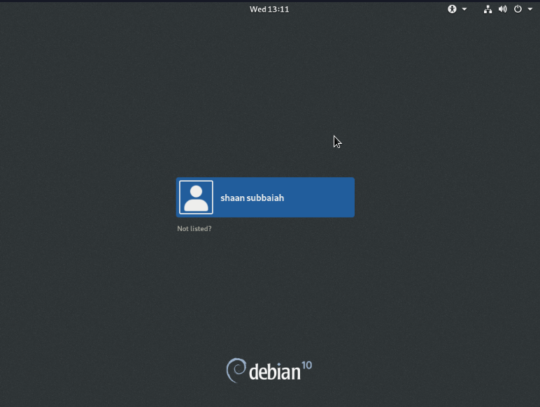
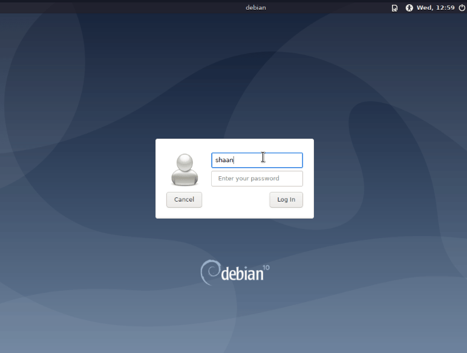
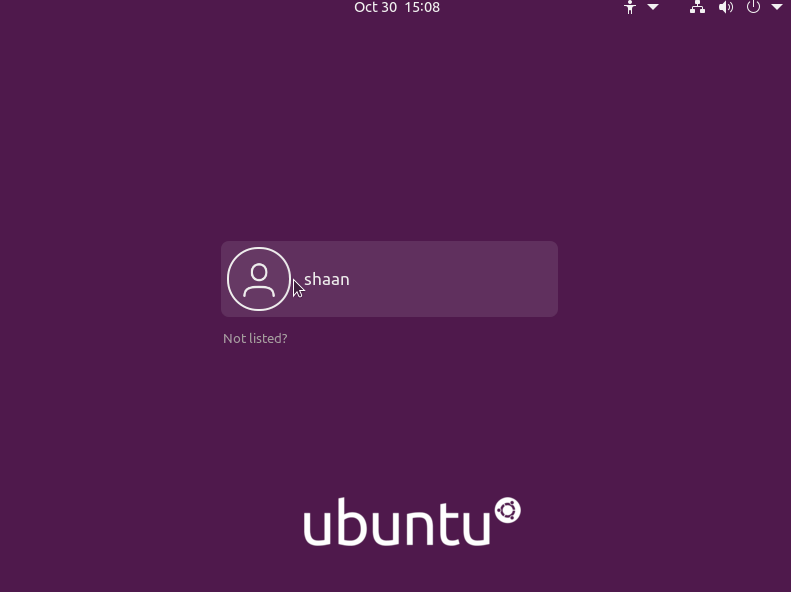
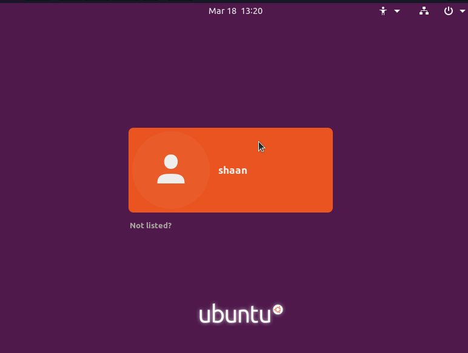

# Guide to logging in with the Sugar desktop

  

You may have installed Sugar on Debian/Ubuntu, Fedora, any other distribution by following the Sugar documentation or may have installed the Sugar Live Build on a Virtual Machine.

  

Each Linux distribution comes with a Display Manager. 

> A Display Manager (DM) is essentially a graphical login program, that
> lets you switch users or switch desktop environments.

The most popular display managers are `GDM`, `LightDM`, and `SDDM`.

* `GDM` is used with the GNOME desktop environment on Debian, Ubuntu and Fedora.

* `LightDM` is used with Raspbian on Raspberry Pi.

* `SDDM` is used with KDE.

To log in with the Sugar Desktop, select **Sugar** at the login screen before logging in.  Depending on the display manager, you may have to select a `gear icon`, `wrench icon` or a `dropdown menu` to do this.

  

## Some examples are shown below:

  

**GDM** - Demonstrated on *Sugar Live Build (Debian)*

* Select `Sugar` after clicking the `gear` icon

**LIGHTDM** - Demonstrated on *Sugar Live Build (Debian)*

* Select `Sugar` after clicking the `gnome footprint icon`

  

**GDM** - on *Ubuntu (Groovy Gorilla)*

* Select `Sugar` from the `gear icon` on the right

**GDM** - Demonstrated on *Ubuntu (Focal Fossa)*

* Select `Sugar` from the `gear icon` on the right

  

**SDDM** - Demonstrated on *Manjaro*

* Switch user and select `Sugar` from the `drop down`

## See Also

You can take a look at other Display Managers [here (Debian Wiki)](https://wiki.debian.org/DisplayManager) and [here (Arch Wiki).](https://wiki.archlinux.org/index.php/Display_manager)

https://gitlab.gnome.org/GNOME/gdm

https://github.com/canonical/lightdm

https://github.com/sddm/sddm
