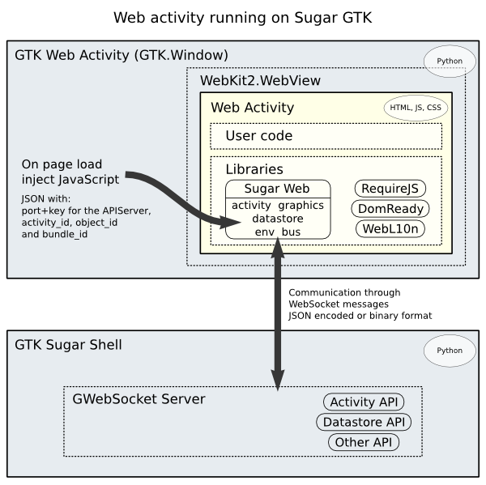

Sugar web architecture
======================

Web Activities
--------------

A sugar web activity is an activity developed using the standard web
technologies: [HTML](dev.w3.org/html5/spec/),
[JavaScript](http://www.ecma-international.org/publications/standards/Ecma-262.htm)
and [CSS](http://www.w3.org/Style/CSS/). They are called "web" because
of the technology used but they run off-line just fine. The activities
are run within the Sugar Shell, an activity runtime built on standard
browser technology, to render the display, assist with events, and
handle JavaScript.

As standard webapps, they are self-contained and run in any modern web
browser. But the focus is on running them bound to Sugar services that
provide the unique features of Sugar.

The web is evolving very fast to provide the same functionality to
webapps that standard desktop applications have.  Web activities
should be developed using standard web technologies as much as
possible.  For example, if there is a need to take a picture from the
device camera, and that is possible with web standards, then those
should be used.  If that is not possible, the activity should
communicate with the Sugar services to take the picture.

Sugar Web library
-----------------

<https://github.com/sugarlabs/sugar-web>

It includes the tools that the activity developer can use to make an
activity.  The Sugar services are delivered as a JavaScript framework,
which supports common application-level functions, UI widgets and
native services.

A copy of the library is contained in each activity.

Sugar Services
--------------

### Web activities on Sugar GTK

Current Sugar GTK can already run web activities out of the box.  It
opens a chrome-less window with a WebKitGTK view, and the web activity
is loaded inside.

The JavaScript interface to connect web activities and Sugar GTK is
being developed.  The interface ends calling the same bits than GTK
activities.  It uses WebSockets for the communication between
JavaScript and Python code.

### Web activities on Android

There is research going on about running web activities on Android.
The activity source is bundled in an Android application with one
component: an [Android
activity](http://developer.android.com/guide/components/activities.html)
(not to confuse with our activity term).  The Android activity is
composed of a chrome-less WebKit view, and the web activity is loaded
inside.  This is the same as other [webapps on
Android](http://developer.android.com/guide/webapps/overview.html) do.

The Android activity [exposes a JavaScript
object](http://developer.android.com/guide/webapps/webview.html#UsingJavaScript)
that the JavaScript libraries inside the web activity can use to
communicate with the Java application.  The application can then
communicate with the Sugar shell application and respond to the web
activity executing JavaScript.

The Sugar shell on Android is a separate process, runs in its own
application with one component: an [Android bound
service](http://developer.android.com/guide/components/bound-services.html).
The inter-process communication is made sending [Message
objects](http://developer.android.com/reference/android/os/Message.html).

Many Android activities can be connected to the Sugar shell.  The
first one starts it, and the last one stops it.  They bind to the
shell sending an [Intent
message](http://developer.android.com/guide/components/intents-filters.html),
for which the shell has an Intent filter that matches.

The Sugar shell on Android should implement all of the Sugar features,
unlike Sugar GTK shell that only needs to connect to the current
features.  But both take adventage of sharing the same JavaScript
interface.  The interface should be platform agnostic.

### Web activities standalone

The standalone web activities are rendered in any modern web browser. They might
have limited functionality but should be as functional as possible. The same
libraries as with the other web activities are used.

Tools
-----

Modularization of JavaScript code is handled with
[RequireJS](http://requirejs.org/) which provides the AMD
specification (Asynchronous Module Definition).

Package management and creation of activities from a template is
handled with [Volo](http://volojs.org/).

Unit testing of JavaScript code is done with the
[Jasmine](http://pivotal.github.io/jasmine/) framework.

Installation of JavaScript tools is done with
[Node.js](http://nodejs.org/).
